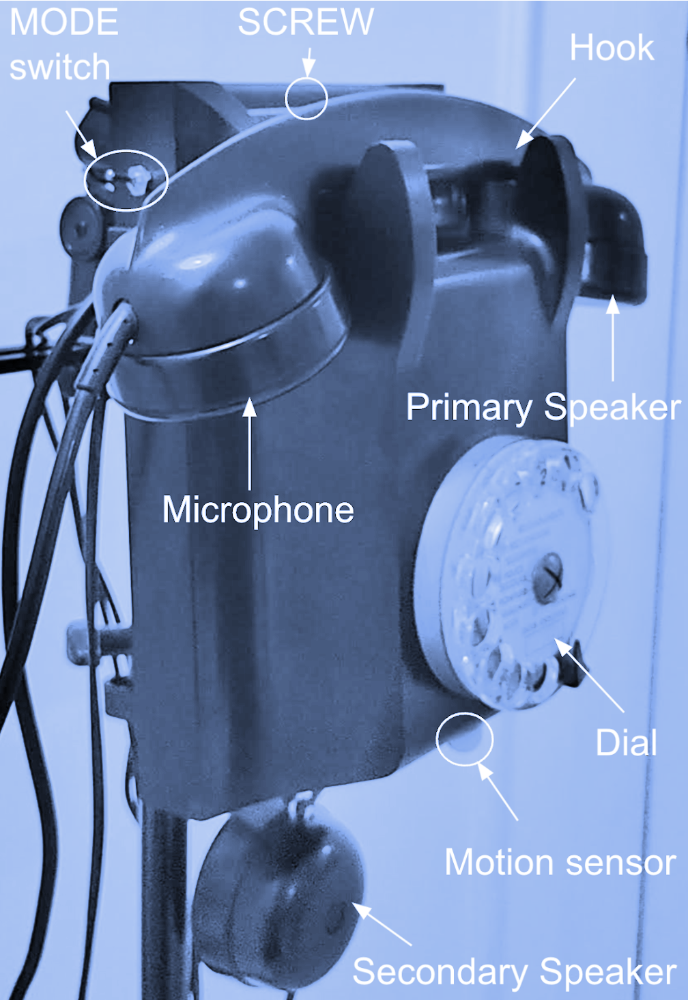
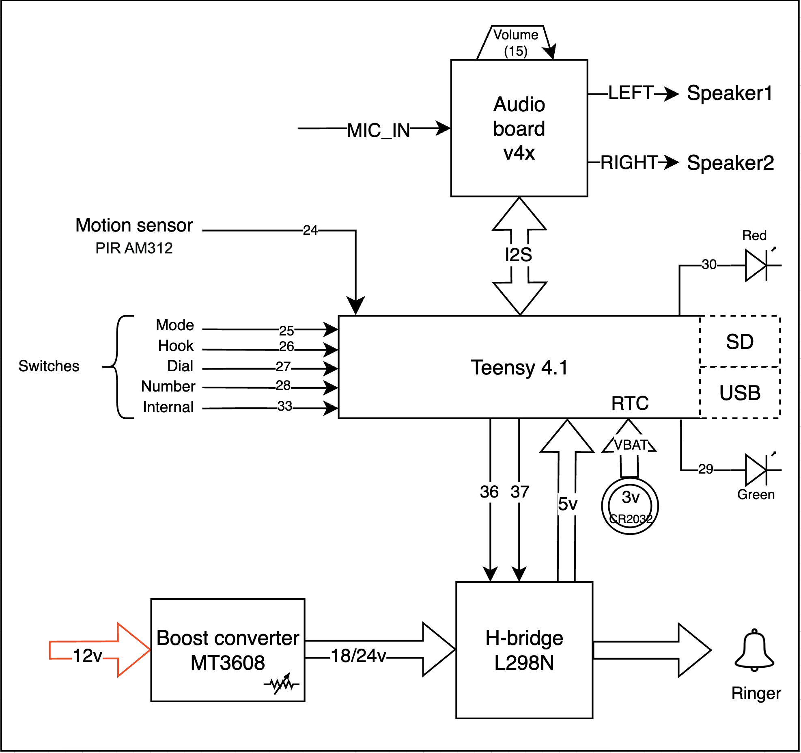
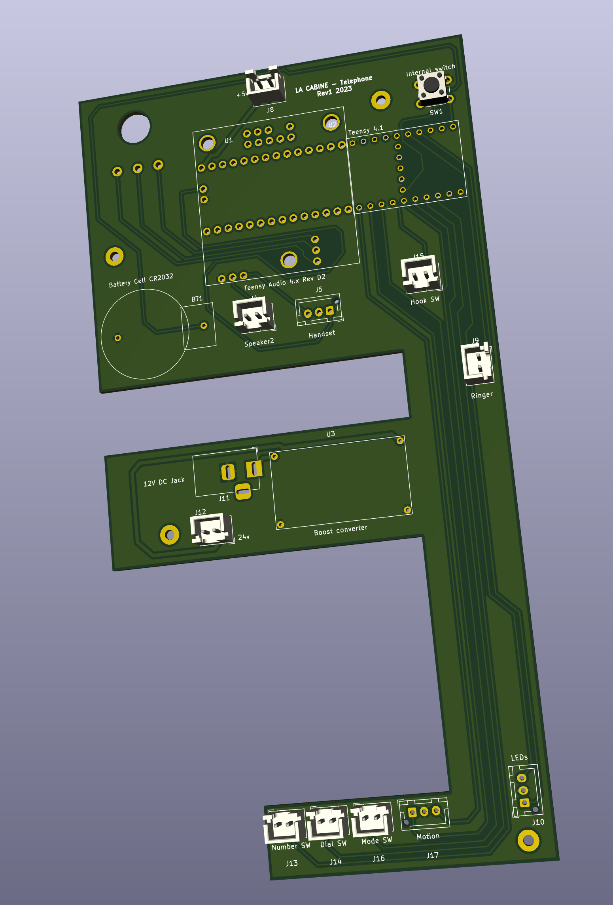
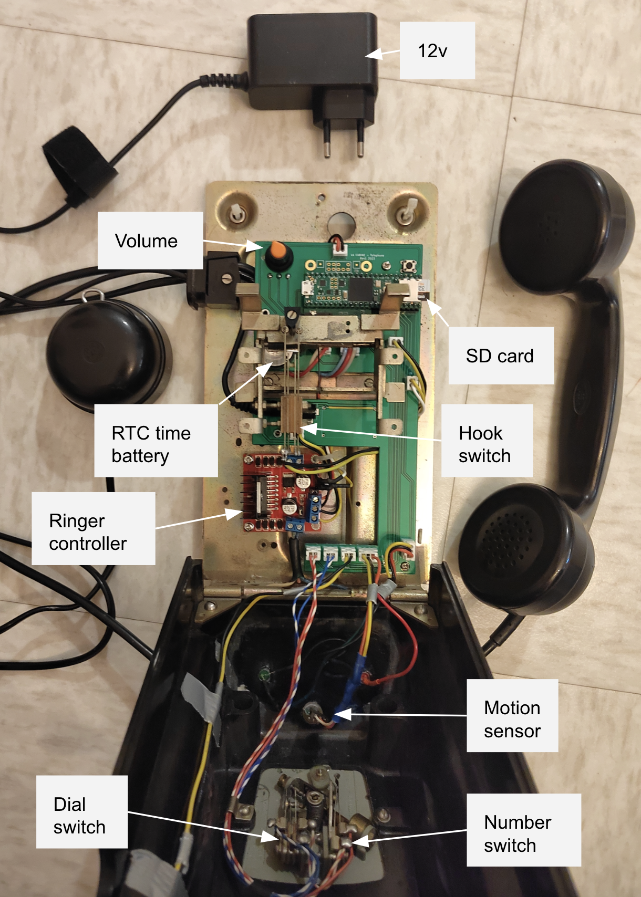
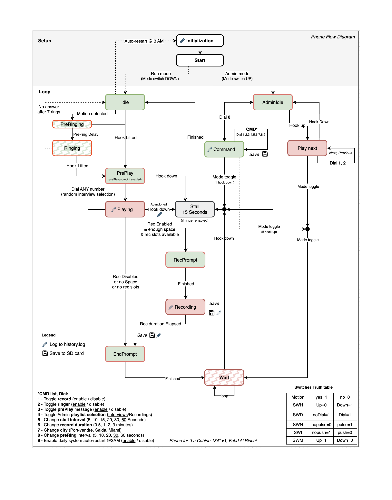

# LA CABINE **134** 

***Support* *contact***: Fahed Al Riachi, <riachi@gmail.com>

# Intro

This manual addresses the usage, configuration and troubleshooting of the “Phone” that is specifically designed for “LA CABINE 134” Installation. A [pdf](resources/Phone%20manual.pdf) and [docx](resources/Phone%20manual.pdf) versions are available in [resources](resources) folder

It is aimed at people with some technical knowledge in order to help facilitating the maintenance of the installation and make sure that the phone is always running correctly, and in case of issues, to have enough info to troubleshoot and/or reach for help 


**What is the expected behavior of the phone when it is operating normally?**

When the phone is in “*Normal Operation*”, it is supposed to ring when a user is in its close vicinity. If the user lifts the phone, the phone will play a pre-recorded interview. When this playback is done, the user is prompted in case he/she wants to record a message. When done, the user can put down the hook/hangup. 

That’s it, when the hook is down, the phone will wait for a while before it starts detecting and taking on new users.



# Normal Operation

To put the phone in “*Normal Operation*” mode ready to receive users:

1. Put MODE switch to LOW position
1. Plug the phone to electrical outlet (220V)
1. Wait until the GREEN led is on        , this means the phone is Idle and ready for usage   


|**Step**|**Led indicator**|
| :- | :-: |
|Phone in Idle mode awaiting users|green|
|Movement detected (1.5 meters around, 80 cm below), the phone will ring (7 rings, if not picked up, it will go back to Idle)|gred/red flash|
|Phone is picked up|none|
|A welcome message is played|green/red|
|A randomly selected *interview* will be played. |red|
|A message will be played informing the user that he/she can record a message of their own|green/red|
|<p>The user can now record / leave a message (2 mins max)</p><p>***Note***: during the last 10 seconds of the recording, the green led will flash each second.</p>|red|
|When done recording, he/she will hear a final goodbye message|green/red|
|Red led will flash awaiting the user to place down the phone|red flashing|
|The phone will pause for 15 secs if ringer/motion is enabled (this to give time for people to leave the phone booth), then it will switch back to GREEN, ready to receive next user|none|
|Phone in Idle mode awaiting users|green|


At any step of the above, the user can decide to stop listening or recording by simply placing the phone back. The phone will stall for 15 seconds (if ringer is enabled), then become green again ready to receive the next user.


**Note**: Sound is always played in both *Primary* and *Secondary* speakers. There could be some sounds played only in either speaker, but this depends on the Interview and how it is designed.
# Admin Menu
Allows changing some of the phone settings, in addition to listen/audition Interviews and recordings directly on the phone outside the ‘Normal operation’ mode (ex: for testing purposes)

**To switch to *Admin* mode**: 

1) Disconnect phone from power
1) Flip the **MODE** switch to the **UP** position 
1) Plug back to power. 

The phone will now start in Admin mode (both GREEN and RED leds will be ON        )

You can leave Admin mode any time (back to “Normal operation”) by simply flipping MODE switch back to DOWN position

## Changing default settings
In Admin mode, **Dial 0.** Both leds should turn OFF . You are now in COMMAND MODE, where some aspects of the “Normal operation” experience can be tweaked and customized.

Below is the list of commands to Dial once in COMMAND mode:

|Setting|Dial|||
| :- | :- | :-: | :-: |
|Enable user RECORDING|**1**|Enabled|Disabled|
|<p>Enable Ringer / movement detection</p><p>(when disabled, the user can pick up the hook any time)</p>|**2**|Enabled|Disabled|
|Enable Pre-Play message (played before interview)|**3**|Enabled|Disabled|
|Interviews/Recordings playlist (used for testing)|**4**|Interviews|Recordings|
|Change STALL interval (the wait time after hook is down, and before the phone can be used by next user)|**5**|15 seconds|15 →  20 →  5 → 10 seconds|
|Change RECORDING duration (the max allowed time per user recording)|**6**|2 minutes|3 → 1 → half minutes|
|Change City / language|**7**|Port-Vendres|Saida → Miami|
|Enable daily system restart (@ 3 AM)|**8**|Enabled|Disabled|
|System Restart |**9**|-|…FLASH…|

Any time a setting is modified the led will flash (GREEN for default value, otherwise RED), and the new value is **saved** and persisted even after turning the phone on/off. You can leave COMMAND mode by dialing **0** and return to Admin menu 

## Audition files

It is possible to listen to any *Interview* or *Recording* on the SD card. When in Admin mode, simply lift the phone hook. RED led should be on. To hear the next file, **dial** **1,** To hear the previous file, **dial** **2.**

By default, you will be able to listen to *Interviews*, but it is possible to change the playlist so you can hear *Recordings* instead (check section: *Changing Default Settings > Interviews/Recordings playlist*).

When done, you can place the hook down in order to go back to Admin menu

# Manage recordings
This section describes the content of the SD card, and how new content can be added


The SD card has 1 folder for each CITY. Each city folder contains the following subfolders:

- **Interviews**: Interviews are placed here. Files **must** 
  - Start with *INT\_*** and end with** *.wav*, anything else will be ignored
  - Format: Stereo, main speaker is LEFT channel (Primary speaker), Optional speaker is Right channel (Secondary Speaker), 16bit, 44.1 Khz
  - Suggested Integrated Loudness: -20 dBFS
  - Suggested dynamic range: max 10 dBs

- **Messages:** these are the messages played to the user at different scenarios. File names should be exactly as specified below
  - *MSG\_PREPLAY.wav*: if enabled (*Command* 3), this is the message the user will hear any time they lift the phone (answer the call)
  - *MSG\_PREREC.wav*: if enabled (*Command* 1), this is the message the user will hear after the Interview playback ends, yet before the RECORDING starts
  - *MSG\_LEAVE.wav*: this is the message the user will hear after the Interview and /or recording ends

- **Recordings:** these are the messages that users have recorded. All files are numbered from 1 to N, having the **.wav** extension. (example: *1.wav*)

Using the **history.log** file it is possible to know which recording was made by the user, and after which the Interview. This is possible by looking at the event name (Playing/Recording) and the timestamp to make the link.

To listen to these files on the phones directly, check section: Admin menu  > *Audition files*

**General notes:** 

- The SD card should be formatted FAT32, max size 64GB
- Files and folders names are Case Sensitive.
- *history.log file will keep track of important events for later inspection: Phone restart, SD card space limit reached, Interview is playing or abandoned, Recording is being made or stopped, a setting has been modified, and Error messages if any*


# Debug

All interactions and errors (if any) are logged to Serial port (very verbose)  

Additionally, significant events are logged to SD card for usage analysis, also for easing support. log file is **history.log**  
Log line format: _[DATETIME ISO],[CITY],[EVENT],[MESSAGE]_


```bash
2023-03-20 9:18:03,/PortVendres,Restarted,SD & RTC OK
2023-03-20 9:18:03,/PortVendres,Playlist size,3 / 100
2023-03-20 9:18:03,/PortVendres,Recordings list size,11 / 1000
2023-03-20 9:18:14,/PortVendres,Restarted,SD & RTC OK
2023-03-20 9:18:14,/PortVendres,Settings,stallPeriod: 5000; recInterval: 120000; recEnabled: 1; ringerEnabled: 1; interviewsSelected: 0; cityIndex: 0; prePlayPrompt: 1; autoRestart: 1
2023-03-20 9:18:14,/PortVendres,Playlist size,3 / 100
2023-03-20 9:18:14,/PortVendres,Recordings list size,11 / 1000
2023-03-20 9:18:45,/PortVendres,Ringing abandoned,After 7 rings
2023-03-20 9:18:59,/PortVendres,Playing,INT_TRIOS.wav
2023-03-20 9:19:19,/PortVendres,Playing abandoned,Interview 'INT_TRIOS.wav' abandoned at 73.53% (@ 19.65/26.72 seconds)
2023-03-20 9:19:37,/PortVendres,Playing,INT_TRIOS.wav
2023-03-20 9:20:04,/PortVendres,Playing ended,Duration(sec): 26.72
2023-03-20 9:20:12,/PortVendres,Recording,12.wav
2023-03-20 9:20:23,/PortVendres,Recording stopped,- Recording stopped (duration: 10.00 sec)
2023-03-20 9:20:40,/PortVendres,Admin,  - Admin playlist has changed to: 0 (1: Interviews, 0: Recordings)
2023-03-20 9:20:43,/PortVendres,Admin,  - Admin playlist has changed to: 1 (1: Interviews, 0: Recordings)
2023-03-20 9:21:01,/PortVendres,Admin,  - Admin playlist has changed to: 0 (1: Interviews, 0: Recordings)
2023-03-20 9:22:01,/PortVendres,Admin,  - Stall period changed to: 20000
2023-03-20 9:22:10,/PortVendres,Admin,  - Stall period changed to: 5000
...
```


# Design

# Hardware







# Software

Code is [here](phone/phone.ino) running on Teensy 4.1 with Teensy Audio board 4.x rev D



